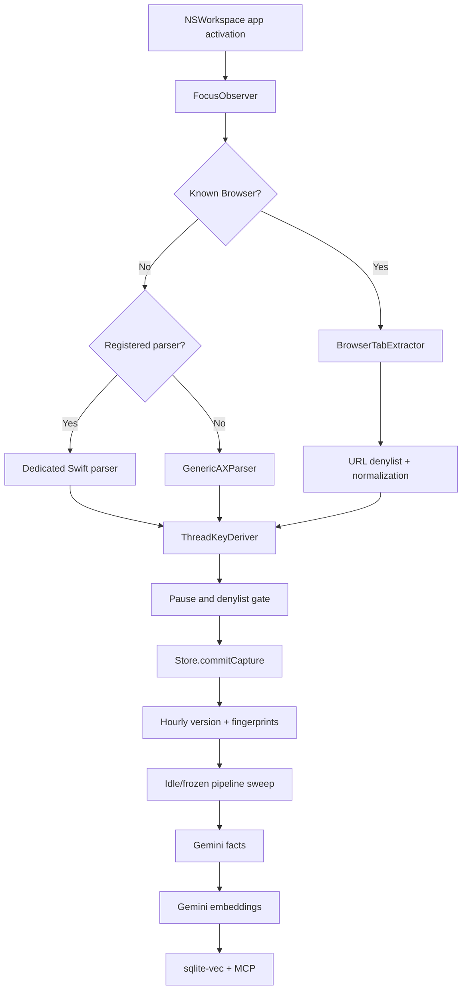

# Minimi → MaxMi: Reverse-Engineering Record, Current-State Audit, and Parity Blueprint

**Audit date:** 2026-07-13

**Reference Minimi build:** 1.0.59, installed at `/Applications/Minimi.app`

**MaxMi branch:** `main` at `86ccbc8`, plus the uncommitted work listed in §5.10

**Purpose:** establish one canonical, evidence-based account of what was learned from Minimi, what has been built in MaxMi, why MaxMi still misses substantial context, and what must be done to make MaxMi a dependable personal Minimi replacement.

---

## 1. Executive summary

MaxMi is not an empty prototype. Its core memory pipeline works:

- it captures Accessibility text from supported browsers and native applications;
- normalizes pages/windows into stable threads;
- versions and deduplicates snapshots in SQLite;
- encrypts sensitive text fields with AES-256-GCM;
- extracts atomic facts with Gemini;
- embeds those facts into a local sqlite-vec index;
- exposes local memory through an MCP server;
- contains implementations for meetings, activity summaries, an hourly action-item agent, privacy settings, and native SwiftUI windows.

The live MaxMi database confirms that the core has operated successfully: 592 threads, 890 versions, and 3,534 fully embedded facts with no retry backlog and a clean SQLite integrity check.

However, MaxMi is not yet a Minimi replacement. It is currently best described as a **frontmost-window visible-text sampler with a strong storage/retrieval backend**. Minimi 1.0.59 is a broader context system: it has more browser routing, many structured native parsers, separate web/native helper executables, off-screen collection policies, meeting-specific monitors, voice notes, richer activity/conversation modeling, a more capable MCP contract, guided Claude connection, configurable privacy controls, and a complete tray/onboarding/update experience.

The largest problem is capture coverage, not visual polish. MaxMi misses or degrades context because it:

- only snapshots the frontmost window;
- relies mainly on the currently materialized macOS Accessibility tree;
- recognizes only six browsers as true browsers;
- sends all other browsers through the generic native-app path;
- lacks most of Minimi's structured app-specific extractors;
- has no safe off-screen/virtualized-content collection framework;
- truncates many native captures to 8,000 characters;
- can overwrite earlier within-hour snapshot content after it scrolls out of view;
- has incomplete meeting detection and incorrect system/microphone audio composition;
- has no voice-note capture;
- provides no capture-health UI, so missed context is silent.

The correct next milestone is therefore **Capture Coverage V2**, preceded by a short correctness pass for the consent, browser-safety, and meeting bugs documented here. The backend behavior used by MaxMi was not guessed: it came from the earlier HTTP Toolkit and Node-inspector interception work described in §3.1.

---

## 2. Evidence standard

This document distinguishes three confidence levels:

- **Verified:** observed directly in MaxMi source/tests/database, Minimi's installed bundle, Minimi's readable parser source, Minimi's preload API, Minimi's SQLite schema, or a captured network request.
- **Strong inference:** supported by binary strings, schema, UI assets, process arguments, or multiple pieces of indirect evidence, but not exercised end to end during this audit.
- **Planned/intended:** described in a MaxMi specification or plan, but not necessarily proven in the current application.

No private captured content, authentication token, MCP connection URL, page URL, message, transcript, or API key is reproduced in this document. Database observations are aggregate counts and statuses only.

### 2.1 Primary Minimi evidence

1. Installed Minimi 1.0.59 bundle and `Info.plist`.
2. `app.asar` package manifest, React bundles, preload IPC surface, and readable AX parser source.
3. Executable/helper inventory under `Contents/Resources/exec`.
4. Strings from the compiled Electron main process and MCP bytecode.
5. Read-only inspection of Minimi's SQLite schema and aggregate row counts.
6. Live process arguments for its meeting/focus helper processes.
7. The HTTP Toolkit dual-network-stack interception setup and HAR-scrubbing workflow.
8. The companion Node-inspector fetch interception recorded in [minimi-backend-contract.md](minimi-backend-contract.md).
9. The preserved private capture `captures/minimi-net-2026-07-07.log`, inspected only for aggregate endpoint/shape evidence.
10. The repository's helper scripts:
   - `tools/inspect-minimi-net.mjs`
   - `tools/launch-minimi-intercepted.sh`
   - `tools/scrub-har.mjs`

### 2.2 Primary MaxMi evidence

1. Current Swift source and package graph.
2. All specifications and implementation plans under `docs/superpowers/`.
3. Current tests: 329 passing with Xcode's Swift toolchain.
4. Read-only aggregate inspection of `~/Library/Application Support/MaxMi/maxmi.db`.
5. The built `MaxMi.app`, its bundle metadata, signature, resources, and Gatekeeper result.
6. Git history and the current uncommitted working tree.

---

## 3. What was extracted from Minimi

### 3.1 HTTP Toolkit and live-network reverse engineering

The backend contract was discovered through live interception, not inferred solely from binary strings or database tables.

#### Why two interception layers were necessary

Minimi is an Electron application with more than one network path:

- Node-side requests used for memory extraction, embedding, rewriting, and related backend work;
- Chromium's network service for renderer/browser-style requests such as billing or other UI traffic.

The HTTP Toolkit launcher therefore configured both:

1. **Node interception** through HTTP Toolkit's `prepend-node.js` require hook in `NODE_OPTIONS`.
2. **Chromium interception** through Electron's `--proxy-server` argument.

It also configured:

- HTTP Toolkit's local CA through `NODE_EXTRA_CA_CERTS`;
- uppercase and lowercase HTTP/HTTPS proxy environment variables;
- `GLOBAL_AGENT_HTTP_PROXY` for Node libraries using global-agent;
- loopback bypassing to prevent the proxy from routing back into itself;
- detached launch and a separate startup log so closing the terminal did not kill Minimi.

This setup is preserved in `tools/launch-minimi-intercepted.sh`.

#### Node-inspector companion capture

Proxy interception did not reliably expose every Node-side body, so a second tool attached to Minimi's Electron main process on the Node inspector port. `tools/inspect-minimi-net.mjs`:

- discovered the inspector WebSocket target;
- injected a wrapper around `globalThis.fetch`;
- filtered traffic to `projectminimi.com`;
- cloned response bodies without consuming the real response;
- recorded timestamp, method, URL, status, request body, and response body;
- bounded logged bodies to avoid uncontrolled capture size.

This was a companion to the HTTP Toolkit work, not a replacement for it: HTTP Toolkit established the full dual-stack interception setup, while the inspector hook provided dependable request/response shapes for the memory calls.

#### Preserved capture and privacy handling

The private capture was archived as `captures/minimi-net-2026-07-07.log`. The repository deliberately ignores `captures/` and `*.log` because the artifact contains real screen/page content.

For HTTP Toolkit or mitmproxy HAR exports, `tools/scrub-har.mjs`:

- retains only the target host;
- redacts authorization, cookie, API-key, token, session, secret, password, and signature data;
- removes cookies;
- redacts sensitive query parameters;
- truncates request/response bodies while preserving enough JSON shape for analysis;
- requires human review before sharing.

#### Quantitative result

The preserved session contains 70 JSONL records: one capture-note record followed by 69 successful backend requests:

| Endpoint | Count | Status | Confirmed request keys |
|---|---:|---:|---|
| `/api/memory/extract` | 6 | 200 | `new_content`, `previous_content`, `metadata` |
| `/api/memory/embed` | 26 | 200 | `text` |
| `/api/memory/rewrite-for-display` | 1 | 200 | `memories` |
| `/api/posthog/events` | 36 | 200 | `eventName`, `properties` |
| **Total requests** | **69** |  |  |

The 6 extract requests producing 26 embedding requests confirmed the derivative model: one captured source can yield several atomic facts, and each fact is embedded separately.

#### Findings established by the intercept

The live traffic established that:

- backend traffic went to `https://backend.projectminimi.com`;
- extraction receives current content, optional previous content, and source metadata;
- extraction returns plain-English atomic memory strings rather than a complex object graph;
- facts are stored in third person;
- every fact is embedded whole, one request per fact;
- embeddings are 1,536-dimensional according to the captured contract/database evidence;
- display rewriting is a distinct step that converts stored facts into user-facing second-person copy;
- analytics traffic is frequent but irrelevant to a personal clone;
- all six observed extract calls had `previous_content=null` because they were first captures of different sources, so the intercept could not determine Minimi's exact same-thread previous-version selection rule;
- meeting, voice-note, hourly-review, conversation-detection, authentication, and billing endpoints were not exercised in this capture and were documented separately from binary/schema evidence.

#### Direct influence on MaxMi

This interception work drove several early MaxMi decisions:

- `MemoryRelay.extract` mirrors current/previous content plus source app/key;
- `ExtractPrompt` produces atomic third-person facts;
- derivatives are stored as individual rows;
- every derivative is embedded whole at 1,536 dimensions;
- the capture pipeline passes the previous frozen snapshot for diff-aware extraction;
- the retry queue treats extract and embed as network work;
- PostHog/account/billing behavior was intentionally omitted;
- display rewriting was recognized as separate from storage, although MaxMi still lacks Minimi's recent-memory display surface;
- the design explicitly acknowledges that MaxMi sends plaintext captured content to Gemini even though local fields are encrypted at rest.

The reverse-engineering record is preserved in [minimi-backend-contract.md](minimi-backend-contract.md), and the initial M1 design cites it as the foundation for MaxMi's extraction/embedding pipeline.

### 3.2 Product model

Minimi is an Electron menu-bar application whose primary product loop is:

```mermaid
flowchart LR
    Focus[Focus/window/app event] --> Route[Classify browser, native app, meeting, or voice note]
    Route --> Helper[Dedicated helper or AX parser]
    Helper --> Thread[Normalize into a logical thread]
    Thread --> Version[Store encrypted version]
    Version --> Extract[Cloud fact/activity/meeting extraction]
    Extract --> Embed[Embed memories]
    Embed --> Surfaces[Tray, activity, action items, Claude/MCP]
```



The important point is that Minimi is not implemented as one generic AX scrape. It uses a routing layer and multiple acquisition strategies:

- generic web content;
- dedicated web-app extractors;
- generic native content;
- dedicated native helper executables;
- JavaScriptCore-style structured AX parsers;
- meeting/microphone monitors;
- audio capture processes;
- activity/conversation classification;
- voice-note capture.

That architectural breadth is the main reason it captures more context than MaxMi today.

### 3.3 Browser coverage

The installed Minimi meeting-monitor configuration explicitly recognizes these browsers:

| Browser | Bundle identifier |
|---|---|
| Chrome | `com.google.Chrome` |
| Firefox | `org.mozilla.firefox` |
| Arc | `company.thebrowser.Browser` |
| Dia | `company.thebrowser.dia` |
| Safari | `com.apple.Safari` |
| Brave | `com.brave.Browser` |
| Microsoft Edge | `com.microsoft.edgemac` |
| Comet | `io.comet.Comet` |
| Opera | `com.operasoftware.Opera` |
| Vivaldi | `com.vivaldi.Vivaldi` |
| Zen | `app.zen-browser.zen` |
| Orion | `com.kagi.kagimacOS` |
| ChatGPT Atlas | `com.openai.atlas` |

Minimi also has dedicated web helpers for:

- generic web content;
- Discord;
- Gmail;
- LinkedIn;
- Outlook;
- Slack;
- Microsoft Teams;
- WhatsApp.

This means that "browser support" in Minimi is not merely recognizing a browser process. It includes identifying the active URL/site and routing supported web applications to a semantic extractor.

### 3.4 Dedicated native helpers

The installed Minimi bundle contains these relevant executables:

| Helper | Role |
|---|---|
| `focus-change-handler` | Focus/app/window event source |
| `get-native-content` | Generic native Accessibility capture |
| `get-web-content` | Generic browser Accessibility capture |
| `get-slack-content` | Native Slack extraction |
| `get-discord-content` | Native Discord extraction |
| `get-teams-content` | Native Teams extraction |
| `get-whatsapp-content` | Native WhatsApp extraction |
| `get-native-outlook-content` | Native Outlook extraction |
| `captureAudio` | Audio capture process |
| `meetings` / `meetings-coreaudio` | Meeting capture/detection support |
| `google-meet-monitor` | Google Meet-specific monitoring |
| `micwatch-detector` | Microphone-process and meeting-app detection |
| `keyboard-monitor` | Keyboard/activity signal helper |
| `tcc-audio-permission` | Audio-permission handling |
| `experience-claude` | Claude onboarding/experience integration |

The exact internal behavior of compiled helpers is not always readable, but their process arguments and strings establish the supported applications and their responsibilities.

### 3.5 Readable structured AX parsers

Minimi 1.0.59 ships readable JavaScript parser source for these applications:

| Category | Parsers |
|---|---|
| Calendar | Apple Calendar, Fantastical |
| Email | Apple Mail, Microsoft Outlook, Spark Desktop, Spark Mail |
| Chat/collaboration | Microsoft Teams |
| Documents | Microsoft Word, Pages, Notes, Notion, Obsidian |
| Tasks/productivity | Microsoft To Do, OmniFocus, Todoist, Toggl |

The parser runtime exposes reusable primitives for:

- stable role/identifier matching;
- XPath-like tree navigation;
- visual ordering;
- format-based time/date detection;
- locale-tolerant label normalization;
- off-screen list collection;
- `NOT_HANDLED` fallback signaling;
- structured output such as tasks, events, conversations, and documents.

Several parsers declare explicit off-screen policies such as:

- collect list overflow plus a bounded number of off-screen rows;
- always collect off-screen content for Word/Pages;
- never collect it for specific apps where it is unsafe or unreliable.

This per-parser policy is materially more capable than MaxMi's current one-size-fits-most AX snapshot.

### 3.6 Meeting detection and capture

Verified Minimi meeting configuration includes:

- native Zoom;
- Microsoft Teams;
- Cisco Webex;
- Slack;
- WhatsApp;
- browser meetings across the browser list above;
- URL-pattern detection for Google Meet, Zoom, Teams, Webex, and Slack;
- start cooldown and stop grace periods;
- microphone and system-audio capture;
- a right-lane recording UI;
- meeting extraction, summary, and searchable memory.

The important behavior is **browser URL awareness**. Browser microphone use alone is not enough to prove that a meeting exists; Minimi also checks known meeting hosts and paths.

### 3.7 Voice notes

Minimi exposes IPC and UI for:

- starting a voice note;
- stopping a voice note;
- live audio level;
- a dedicated voice-note window;
- extracting and storing voice-note memory;
- meeting/voice retrieval through MCP.

MaxMi currently has no voice-note mode.

### 3.8 Memory extraction and embedding contract

The July 7 network interception established the original backend contract.

#### Memory extraction

`POST /api/memory/extract`

- input: current content, optional previous content, source app, and source key;
- output: an array of atomic, self-contained, third-person fact sentences;
- observed count: usually 2–5 facts for a meaningful page;
- facts are stored in third person for assistant context.

#### Embedding

`POST /api/memory/embed`

- input: one complete fact sentence;
- output: a 1,536-dimensional embedding;
- one embedding per derivative/fact;
- no fact chunking.

#### Display rewriting

`POST /api/memory/rewrite-for-display`

- stored third-person facts are rewritten into second person for UI display;
- e.g. stored assistant context and user-facing copy intentionally differ.

#### Additional observed/inferred endpoints

- activity conversation detection;
- hourly activity review;
- meeting extraction;
- meeting summarization;
- voice-note extraction;
- authentication and billing;
- analytics.

Authentication, billing, and analytics are not necessary for a personal MaxMi build and should not be cloned merely for parity.

### 3.9 Storage model

Minimi's current database contains:

- memory threads;
- memory versions;
- memory derivatives;
- version and derivative vector tables;
- message fingerprints;
- retry queue;
- activity app visits;
- activity conversations;
- agent runs;
- agent action items;
- settings and schema migrations.

The current live Minimi database had, at audit time, 422 threads, 782 versions, 4,282 embedded derivatives, 2,224 app visits, and 162 activity conversations. These aggregate counts establish that both memory and activity pipelines are active in normal use.

Minimi's activity model is conversation/content oriented. `activity_conversations` records:

- app and bundle;
- a semantic sub-kind (`chat`, `website`, or `document`);
- stable sub-key and label;
- summary;
- detected/start times;
- before/new character counts;
- the memory version/thread that supplied the evidence.

That is more granular than MaxMi's current app-session summaries.

### 3.10 MCP contract

The original July 7 MaxMi notes were based on an older Minimi contract and identified three tools. The installed Minimi 1.0.59 binary now exposes evidence of four:

1. `search_memory`
2. `list_active_threads`
3. `get_latest_context`
4. `meeting_memory`

Current Minimi MCP behavior also includes evidence of:

- source-app filtering;
- time ranges and relative look-back durations;
- pagination/cursors or offsets;
- latest-context retrieval ranked by freshness rather than topic similarity;
- timezone and `as_of_local` metadata;
- meeting `list`, `search`, and `get_context` actions;
- thread IDs as explicit meeting context keys.

`get_latest_context` is particularly important. Semantic fact search is not a substitute for answering "what is on my screen now?" or "what was I just doing?".

### 3.11 User-facing surfaces

Minimi 1.0.59 contains:

- onboarding and Google sign-in;
- explicit Accessibility, microphone, and system-audio permission flows;
- recent memories;
- memory search;
- activity/conversations by day;
- action items;
- meeting nudges and recording state;
- voice-note recording;
- Claude overlay guidance;
- local MCP enable/disable and URL/status;
- automatic Claude Desktop configuration;
- restart-Claude guidance;
- per-app conversation disabling;
- blocked-domain settings;
- pause/resume state;
- launch at login;
- logs/admin surfaces;
- auto-update UI and progress.

For a personal MaxMi build, account, billing, remote analytics, and marketing onboarding can remain intentionally absent. Capture observability, privacy, retrieval, permissions, meeting/voice controls, and Claude setup are functional necessities rather than commercial-product extras.

---

## 4. What the previous MaxMi documents established

MaxMi's existing documentation is valuable but fragmented across milestone specs, plans, and review transcripts. This section summarizes the intended progression.

### 4.1 M1 — capture to local memory database

Source: [2026-07-07-maxmi-capture-to-db-design.md](superpowers/specs/2026-07-07-maxmi-capture-to-db-design.md)

Established:

- browser Accessibility capture;
- logical threads and hourly versions;
- content hashing and exact deduplication;
- frozen/idle extraction;
- Gemini fact extraction and embedding;
- sqlite-vec search index;
- retry queue;
- environment-based Gemini configuration;
- hard-coded privacy denylist.

Important accepted limitation: re-capturing within an hour replaces that version's content with the current AX tree. Text that scrolled out of a virtualized view can therefore disappear from the stored snapshot, even though facts extracted earlier may survive.

### 4.2 M2 — local MCP memory server

Source: [2026-07-07-maxmi-m2-mcp-server-design.md](superpowers/specs/2026-07-07-maxmi-m2-mcp-server-design.md)

Established:

- a read-only local stdio MCP process;
- semantic memory search;
- recent thread listing;
- an initially stubbed meeting tool;
- lazy database opening;
- query-vector caching;
- manual Claude registration.

The specification claimed Minimi parity based on the older three-tool contract. That claim is now outdated relative to Minimi 1.0.59.

### 4.3 M3 — encryption and signing

Source: [2026-07-07-maxmi-m3-encryption-signing-design.md](superpowers/specs/2026-07-07-maxmi-m3-encryption-signing-design.md)

Established:

- AES-256-GCM per-field encryption with the `enc:v1:` format;
- login-Keychain storage for the database key;
- plaintext compatibility/backfill;
- fail-closed capture if the encryption key is unavailable;
- shared key access for the app and MCP executable;
- signed app packaging.

Known residuals remain intentionally documented: URLs, titles, metadata, and vectors are cleartext; Gemini receives plaintext content; embeddings may leak semantic information; key loss makes old encrypted content unrecoverable.

### 4.4 M4 — native parser framework

Sources:

- [2026-07-08-maxmi-m4-native-app-parsers-design.md](superpowers/specs/2026-07-08-maxmi-m4-native-app-parsers-design.md)
- [2026-07-08-maxmi-m4-completion-design.md](superpowers/specs/2026-07-08-maxmi-m4-completion-design.md)

Established:

- `SourceParser` and `ParserRegistry`;
- a generic native AX fallback;
- no-silent-fallback for registered parsers;
- Slack parser;
- Notion, Obsidian, and Notes document parsers;
- per-app and per-thread capture pauses;
- later additions for Mail, Discord, Messages, and terminals.

M4 explicitly deferred native helpers and accepted weak WhatsApp extraction through the generic fallback. That was reasonable for a framework milestone, but it means M4 completion did not equal Minimi capture parity.

### 4.5 Clean Capture — stable keys and fingerprint dedup

Source: [2026-07-10-maxmi-clean-capture-design.md](superpowers/specs/2026-07-10-maxmi-clean-capture-design.md)

Established:

- a central thread-key derivation chokepoint;
- URL normalization;
- message fingerprints;
- regression fixtures for key stability;
- fixes for Maps coordinates, Google Docs account/tab state, terminal key noise, and near-duplicate message commits.

This was an important quality improvement and is one of MaxMi's strongest implemented subsystems.

### 4.6 M5 — meeting capture

Source: [2026-07-11-maxmi-m5-meetings-design.md](superpowers/specs/2026-07-11-maxmi-m5-meetings-design.md)

Intended:

- CoreAudio meeting detection;
- ScreenCaptureKit system audio plus microphone;
- consent-first right-lane recorder;
- on-device Whisper transcription;
- encrypted meeting storage;
- real MCP meeting retrieval.

The plan was heavily reviewed, but several approved requirements were not actually completed in the implementation: timestamp-aligned audio mixing, meeting-window panel repositioning, robust browser meeting classification, and live end-to-end proof.

### 4.7 M6 — activity, hourly agent, and UI

Source: [2026-07-11-maxmi-m6-activity-agent-ui-design.md](superpowers/specs/2026-07-11-maxmi-m6-activity-agent-ui-design.md)

Intended:

- app visits and sessionized evidence;
- Gemini activity summaries;
- explicit consent;
- app exclusions;
- hourly action-item review;
- durable agent cursor and leases;
- Activity and Action Items windows;
- launch at login, status, and settings;
- dog icon and polish.

Most of this exists in code and unit tests. It is not operational on the audited machine because the consent state is `declined`, and the UI contains a bug that prevents a declined user from granting consent later. Consequently the live MaxMi database has no activity sessions, agent runs, or action items.

---

## 5. What MaxMi actually contains today

### 5.1 Package architecture

| Target | Responsibility |
|---|---|
| `MaxMiCore` | Shared contracts, capture pipeline, hashing, IDs, encryption types, time buckets |
| `MaxMiStore` | SQLite/GRDB schema, versioning, dedup, encryption boundary, vectors, meetings, activity, agent state |
| `MaxMiCapture` | AX snapshots, browser extraction, parser dispatch, URL/key normalization, denylist |
| `MaxMiRelay` | Gemini content generation and embeddings, throttling, response parsing |
| `MaxMiMeetings` | Detection, audio capture/mixer, Whisper bridge/transcriber, session state machine |
| `MaxMiActivity` | Display summarizer, hourly agent, prompts and relay protocols |
| `MaxMiUI` | SwiftUI activity, action-item, and settings views/view models |
| `MaxMi` | App lifecycle, menu bar, permissions, dependency wiring, windows and panels |
| `MaxMiMCP` | Local stdio JSON-RPC/MCP server and memory queries |

### 5.2 Current capture flow



Triggers currently include:

- frontmost application activation;
- focused AX element changes;
- AX window-title changes;
- a 1-second debounce;
- periodic re-capture every 45 seconds while a capturable app remains active.

The AX reader captures one focused/main/first window with:

- maximum 20,000 nodes;
- maximum depth 40;
- role, value, title, URL/document, focused state, frame, and children;
- no generalized off-screen materialization or scrolling.

### 5.3 Browser support

MaxMi currently treats only these as browsers:

- Chrome;
- Arc;
- Zen;
- Safari;
- Brave;
- Edge.

Other browsers are captured as generic native applications. This is both a quality and privacy defect because they do not use URL keys or the strict web URL denylist.

### 5.4 Dedicated native parsers

MaxMi has dedicated parsers for:

- Slack;
- Discord;
- Apple Mail;
- Apple Messages;
- Notion;
- Obsidian;
- Apple Notes;
- Warp, Terminal, and iTerm2 through one terminal parser.

Everything else uses `GenericAXParser` unless denied.

#### Parser limitations

- Slack assumes AX rows and a fixed sidebar boundary.
- Discord intentionally accepts navigation noise because its frames are unreliable.
- Mail ignores the AX tree and uses AppleScript, but captures only account, sender, and subject for up to six recent messages per account; it does not capture bodies.
- Messages captures text areas/static text but does not reliably attribute sender or distinguish all UI chrome.
- document parsers cap the newest text at 8,000 characters;
- terminal capture takes the newest 8,000 characters of the largest AX text area;
- generic capture collects static text only and keys by bundle plus window title.

### 5.5 Store and extraction

Implemented and verified:

- thread uniqueness by source app/key;
- one mutable version per thread/hour;
- exact content hashing;
- fingerprints for incremental messages;
- automatic freezing/idle extraction;
- previous frozen content supplied to Gemini for diff-aware extraction;
- derivative deduplication;
- 1,536-dimensional normalized Gemini vectors;
- sqlite-vec nearest-neighbor search;
- retry queue and backoff;
- AES-GCM encryption for version, derivative, summary, evidence, action-item, and transcript text;
- Time Machine exclusion and restrictive database permissions.

### 5.6 MCP

MaxMi currently exposes:

- `search_memory(query, limit)`;
- `list_active_threads(limit)`;
- `meeting_memory(action, query)`.

Meeting actions are `list`, `search`, and `get_context`. The implementation is real, but the parameter shape overloads `query` as the meeting ID for `get_context` and does not match current Minimi's explicit `thread_id` shape.

Missing relative to Minimi 1.0.59:

- `get_latest_context`;
- source-app filters;
- time ranges/look-back duration;
- pagination/cursor support;
- timezone/as-of metadata;
- richer latest/raw-context responses;
- guided connection and Claude Desktop configuration.

### 5.7 UI and settings

Implemented:

- menu-bar icon;
- left-click Activity/Action Items popover in the current working tree;
- full Activity window;
- Action Items open/archive UI;
- Activity Privacy window;
- Settings window;
- launch-at-login state;
- per-app activity exclusion;
- capture pause menu;
- per-thread pause action;
- status lines for Accessibility/API key/encryption;
- manual update message.

Missing:

- recent memory feed;
- memory search UI;
- latest context/current screen UI;
- meeting history UI;
- voice notes;
- capture diagnostics;
- failed/skipped capture explanations;
- API-key setup UI;
- capture-domain settings;
- complete paused-thread/app management;
- automatic update delivery;
- guided MCP/Claude connection.

### 5.8 Live verified state

At audit time:

| Metric | Value |
|---|---:|
| Threads | 592 |
| Versions | 890 |
| Extracted/embedded facts | 3,534 |
| Retry queue | 0 |
| Message fingerprints | 22,148 |
| Meetings | 0 |
| Activity visits | 0 |
| Activity sessions | 0 |
| Agent runs | 0 |
| Action items | 0 |
| SQLite integrity | OK |

The corpus included evidence of useful capture from Web, Slack, Warp, Discord, Mail, Notes, Obsidian, Messages, Notion, Cursor, and WhatsApp through the generic fallback. It also included low-value or self-referential capture from MaxMi, Minimi, Spotify, Stats, User Notification Center, and `loginwindow`.

This proves that memory capture works, while also proving that the capture-by-default policy needs better system/self exclusions and quality diagnostics.

### 5.9 Current verification status

- 329 tests pass using `DEVELOPER_DIR=/Applications/Xcode.app/Contents/Developer swift test`.
- A plain `swift test` fails on this machine because the selected Command Line Tools toolchain does not provide XCTest; the project itself builds under Xcode's toolchain.
- The existing `MaxMi.app` is Apple Development signed and internally valid.
- Gatekeeper rejects it for external distribution because it is not Developer ID signed/notarized.
- No live meeting row exists, so M5 has not been proven end to end.
- No live activity/agent row exists, so M6 has not been proven end to end.

### 5.10 Uncommitted work at audit time

The working tree contains user-owned changes that must be preserved:

- left-click menu-bar popover wiring;
- fresh-install Whisper model-directory fix;
- a regression test for the model-directory bug;
- revised application/tray icon assets.

The fresh-install Whisper fix is correct and passes its test.

---

## 6. Why MaxMi does not capture everything Minimi captures

### 6.1 Capture is frontmost-window only

MaxMi reads one focused/main/first window from the currently active application. It does not continuously inspect:

- background conversations;
- multiple windows in the same app;
- browser tabs that are not active;
- background documents;
- notifications as structured events;
- calendar/task state unless exposed in the frontmost window;
- content that never enters the current AX tree.

This is not necessarily wrong for privacy and resource use, but it must be understood: "ambient memory" does not mean "all machine state."

### 6.2 Accessibility trees are incomplete

Many applications virtualize content. Only visible rows or a small surrounding window exist in the Accessibility tree. Other applications render text into canvas/web views or expose shallow trees.

Consequences include:

- scrolled-away chat messages vanish;
- long documents are partial;
- Slack/Discord sidebars can contaminate content;
- WhatsApp may expose almost no useful text;
- browser pages with canvas/custom rendering appear empty;
- complex email/task/calendar apps lose semantic structure.

Minimi mitigates this with per-app helpers, structured selectors, and explicit off-screen collection policies.

### 6.3 The browser registry is incomplete

Unsupported browsers go through the generic native path. They lose:

- canonical URL thread keys;
- query/tracking normalization;
- site-specific web routing;
- address-bar typing protection;
- strict browser-internal URL blocking;
- banking/auth/meeting/adult URL checks.

This is a P0 privacy and correctness issue, not just a parity enhancement.

### 6.4 App-specific semantics are missing

A generic newline-joined text dump cannot reliably infer:

- chat sender, channel, timestamp, and message boundaries;
- email sender, recipients, subject, body, and thread;
- task title, project, due date, status, tags, and duration;
- calendar title, time, location, organizer, and conference link;
- document title, body, selection, and stable document identity.

Minimi's structured parsers produce these semantic objects before memory extraction. MaxMi currently asks Gemini to recover semantics from noisier text after the fact.

### 6.5 Snapshot replacement loses accumulated context

Within an hour, MaxMi updates the same version row. If an AX tree later contains a different visible slice, the stored content is replaced. Earlier facts may survive if extraction already ran, but the raw context does not.

For high-churn chat, terminal, feed, and document windows, capture should be an incremental accumulator rather than full replacement.

### 6.6 Content caps are blunt

The 8,000-character tail cap prevents unbounded storage and model cost, but it can remove:

- early conversation context;
- document definitions needed by later sections;
- task/calendar metadata near the top;
- terminal commands associated with recent output.

Caps should be per content type and applied after structural extraction/deduplication, not indiscriminately to a flattened text blob.

### 6.7 Triggers are limited

App activation, focused element changes, title changes, and a 45-second timer do not reliably detect:

- in-page SPA navigation without title change;
- tab changes where Accessibility notifications are missing;
- incremental message arrival without focus change;
- scroll-only changes;
- document edits that keep the same focused element;
- URL changes hidden inside a web area.

### 6.8 Failures are silent

The app logs parser failures but exposes no user-facing capture health. A user cannot answer:

- Which app is MaxMi currently reading?
- What was the last successful capture?
- Which parser handled it?
- Was it deduplicated, blocked, paused, empty, unsupported, or failed?
- How much content was captured?
- Is the fact pipeline caught up?

Without this, claims of broad coverage cannot be measured.

---

## 7. Critical correctness issues to fix before expanding coverage

### 7.1 Activity consent cannot recover from declined

The privacy window grants consent only when the existing state is `.unset`. Closing the first-run privacy window records `.declined`. Later switching activity on writes `activity_enabled=true` but leaves consent declined, while all activity gates require `.granted`.

Result: the user can become permanently unable to enable activity through the UI. The audited live database is in exactly this state.

Required fix:

- turning the explicit consent toggle on must set `.granted` from either `.unset` or `.declined`;
- turning it off should disable synthesis without necessarily erasing the user's consent choice;
- declining and disabling should be represented separately;
- tests must cover unset → granted, unset → declined, declined → granted, granted → disabled, and restart persistence.

### 7.2 Unsupported browsers bypass the web safety gate

Required fix:

- create one canonical browser registry shared by capture and meetings;
- include the full installed-Minimi browser set where technically supported;
- unknown browser-like apps must fail safe or go through a browser detector, not generic native capture;
- every web capture must validate scheme/host/path before storage or Gemini submission;
- fix `stripe.com/login` into host `stripe.com` plus an explicit `/login` path rule;
- add Firefox/Opera/Vivaldi/Dia/Orion/Comet/Atlas privacy regression fixtures.

### 7.3 Meeting detection is overly broad and incomplete

Current behavior treats microphone activity from a recognized browser as a meeting without checking the URL. At the same time, Zen and WhatsApp are missing from the meeting registry.

Required fix:

- classify native meeting apps separately from browsers;
- for browsers, require a supported meeting URL or an explicit user override;
- support Google Meet, Zoom, Teams, Webex, and Slack URL patterns;
- include Zen and the rest of the canonical browser registry;
- include WhatsApp calls if technically detectable;
- implement cooldown, stop grace, and revalidation;
- do not allow a new candidate to overwrite an active prompt/recording.

### 7.4 AudioMixer does not actually mix aligned streams

Current code resamples system and microphone buffers independently, then emits both as sequential frames. `WhisperTranscriber` ignores frame timestamps and appends samples in callback order. This can duplicate elapsed time, reorder speech, and produce poor transcripts.

Required fix:

- convert AVAudio/CM timestamps into a common monotonic timebase;
- buffer both streams in bounded jitter buffers;
- mix overlapping samples by timestamp into one 16 kHz mono timeline;
- insert bounded silence for real gaps;
- prevent callback scheduling order from changing the transcript;
- unit-test offset, overlap, gap, drift, and one-stream-only cases;
- live-test a two-speaker call and verify both sides appear once in correct order.

### 7.5 Meeting panel placement is unfinished

The capture layer resolves the meeting window frame, but the session discards it instead of calling the panel's reposition method.

Required fix:

- extend the presentation protocol with a placement/reposition operation;
- reposition after capture resolves the meeting window;
- test and manually verify multi-monitor/full-screen behavior.

### 7.6 Capture-by-default includes self/system noise

Required default exclusions should include at least:

- MaxMi itself;
- Minimi during comparison testing, unless explicitly enabled;
- login/security agents;
- notification center and transient system overlays;
- screensavers/lock screen;
- system monitoring/status utilities when they yield low-value chrome.

This should be a policy layer with user overrides, not a growing collection of hard-coded accidents.

---

## 8. Detailed parity matrix

| Capability | Minimi 1.0.59 | MaxMi today | Required MaxMi target |
|---|---|---|---|
| Generic web capture | Yes | Yes for six browsers | All canonical browsers, fail-safe routing |
| Dedicated web apps | Discord, Gmail, LinkedIn, Outlook, Slack, Teams, WhatsApp | None as distinct web handlers | Add based on usage priority |
| Generic native capture | Yes | Yes | Keep, with quality/confidence metadata |
| Native chats | Slack, Discord, Teams, WhatsApp, Outlook helpers | Slack, Discord, Messages; weak generic WhatsApp | Structured Slack/Discord/Messages/WhatsApp/Teams |
| Documents | Notes, Notion, Obsidian, Word, Pages | Notes, Notion, Obsidian | Add Word/Pages and better document identity |
| Email | Mail, Outlook, Spark variants, Gmail web | Mail headers only | Full visible email/thread context |
| Tasks | To Do, OmniFocus, Todoist, Toggl | Generic only | Structured task records |
| Calendar | Calendar, Fantastical, Outlook events | Generic only | Structured event records |
| Off-screen collection | Per-parser policy | No generalized support | Safe per-parser bounded policy |
| Incremental chat dedup | Yes | Fingerprints | Preserve and strengthen |
| Raw context accumulation | Multiple/current mechanisms | Hourly replacement | Append/delta accumulator by content type |
| Meetings | Mature detection/helpers | Implemented but unproven/buggy | Repair and live-verify |
| Voice notes | Yes | No | Add on-device voice-note mode |
| Activity | Visits + semantic conversations | App sessions/summaries, currently blocked | Fix consent; consider conversation model |
| Action items | UI/schema/agent surface | Implemented, no live runs | Unlock activity and live-verify |
| Semantic search | Yes | Yes | Keep; add filters/pagination |
| Latest context | Dedicated MCP tool | Missing | Add raw freshness-ranked tool |
| Meeting MCP | Rich list/search/context | Basic list/search/context | Align schema/time filters/pagination |
| Memory UI | Recent/search | Missing | Add tray recent/search/latest |
| Claude setup | Guided connector/local MCP | Manual | Add safe guided setup |
| Capture privacy | Blocked apps/domains, pause | Hard-coded domains + partial pauses | Unified editable capture privacy |
| Permissions | Guided UI | Basic prompts/status | Full onboarding/status/remediation |
| Updates | Auto-update | Manual | Optional signed update path |
| Distribution | Developer ID/notarized | Dev signed only | Notarize if distributed beyond this Mac |

---

## 9. Intentional differences MaxMi should keep

Parity should mean equivalent personal capability, not a line-for-line clone.

MaxMi should intentionally remain:

- native Swift/AppKit/SwiftUI rather than Electron;
- small and resource-efficient;
- personal and local-first;
- free of mandatory accounts;
- free of billing infrastructure;
- free of remote product analytics by default;
- owner-controlled with an inspectable local database;
- able to use on-device transcription;
- explicit about which content is sent to Gemini.

Potential future improvements over both products:

- local embeddings and local fact extraction when quality is sufficient;
- per-source retention policies;
- searchable capture provenance;
- deterministic deletion and export;
- capture-quality scoring;
- a privacy preview before enabling a new parser;
- per-app cloud-processing policies.

---

## 10. Target MaxMi architecture

### 10.1 Canonical application registry

Create one registry used by capture, privacy settings, meetings, diagnostics, and tests.

Each application entry should declare:

- bundle identifiers and aliases;
- kind: browser, chat, email, document, task, calendar, terminal, meeting, system, sensitive;
- acquisition strategy: browser AX, native AX, Apple Events, helper, audio, unsupported;
- parser name/version;
- whether generic fallback is permitted;
- URL patterns if applicable;
- off-screen policy;
- content limits;
- default privacy policy;
- meeting capability;
- user-facing display name/icon.

This eliminates the current drift where the capture browser list and meeting browser list disagree.

### 10.2 Capture result contract

Every attempt should return a structured result, not just `ParsedCapture?`:

```swift
enum CaptureOutcome {
    case captured(CaptureEnvelope)
    case deduplicated(CaptureIdentity)
    case skipped(SkipReason)
    case failed(CaptureFailure)
}
```

`CaptureEnvelope` should include:

- source app and bundle;
- semantic content kind;
- raw proposed key and normalized key;
- title/label;
- structured items when available;
- rendered model text;
- capture timestamp and trigger;
- parser name/version;
- node/item/character counts;
- truncation flag;
- off-screen flag;
- privacy decision metadata;
- confidence/quality score.

This contract powers both storage and diagnostics.

### 10.3 Incremental content accumulator

Replace blind within-hour overwrites with content-kind strategies:

- **Chat:** append new fingerprinted messages; keep sender/time/message structure.
- **Email:** store thread/message identities; append newly observed messages.
- **Document:** store bounded snapshots plus semantic diff/changed regions.
- **Terminal:** append new prompt/output blocks with rolling retention.
- **Web article:** replace snapshot when URL content materially changes.
- **Feed:** append fingerprinted items rather than replacing the visible slice.
- **Calendar/task:** upsert stable structured entities.

The accumulator should produce both:

- the current raw context for latest-context retrieval;
- extraction deltas so Gemini does not repeatedly process old content.

### 10.4 Capture health ledger

Add a small local table recording bounded, non-content diagnostic events:

- timestamp;
- app/bundle;
- trigger;
- parser;
- outcome;
- skip/error code;
- character/item counts;
- duration;
- truncation;
- resulting thread/version IDs.

Do not store raw content or error strings that may contain raw content in this ledger.

The UI should expose:

- currently observed application/window;
- last successful capture per app;
- apps that repeatedly produce empty trees;
- parser failures;
- pipeline backlog;
- permission problems;
- meeting/audio status.

### 10.5 Retrieval layers

MaxMi should expose three distinct retrieval modes:

1. **Semantic facts:** "What did I learn about X?"
2. **Latest raw context:** "What was I just looking at?"
3. **Structured domain memory:** meetings, tasks, calendar, conversations.

Trying to make fact embeddings answer all three leads to weak recency and detail retrieval.

---

## 11. Implementation roadmap

### Phase 0 — correctness and observability foundation

**Goal:** make existing features safe to exercise and make misses visible.

Deliverables:

1. Fix declined → granted activity consent.
2. Create canonical browser/app registry.
3. Route all supported browsers through strict web handling.
4. Fix Stripe and unsupported-browser privacy cases.
5. Exclude MaxMi and system/transient apps by default.
6. Introduce `CaptureOutcome` and skip/failure reason enums.
7. Add bounded capture-health ledger and a basic diagnostics window.
8. Add a live smoke-test checklist/script that does not expose captured content.

Acceptance criteria:

- activity can be declined, later granted, disabled, and re-enabled;
- every installed supported browser either uses browser capture or is explicitly unsupported/blocked;
- no unsupported browser can bypass URL privacy checks;
- the user can see why the last capture did or did not occur;
- existing 3,534 facts remain readable;
- full test suite remains green.

#### Phase 0 implementation status — 2026-07-14

Implemented in the working tree:

- recoverable Activity consent transitions with state-transition tests;
- one canonical registry for browser routing, app capture policy, and meeting classification;
- strict browser routing plus corrected Stripe path blocking;
- default MaxMi, login/security, and transient system exclusions;
- explicit terminal capture outcomes with skip/failure reasons and trigger metadata;
- migration-backed, content-free Capture Health ledger bounded to the latest 500 events;
- **Capture Health…** menu/window showing recent outcomes and diagnostic summaries;
- read-only `tools/check-capture-health.sh` and `docs/PHASE0_LIVE_SMOKE.md`.

Automated tests validate these components. The live app/browser matrix and preservation of the existing personal corpus still require a controlled launch against the user's real installed applications before Phase 0 acceptance can be signed off.

### Phase 1 — Capture Coverage V2 core

**Goal:** stop treating flattened AX snapshots as the universal source model.

Deliverables:

1. Add structured capture envelope and parser versioning.
2. Add content-kind-specific accumulators.
3. Preserve raw latest context separately from extracted facts.
4. Add bounded per-parser off-screen policy infrastructure.
5. Add trigger metadata and adaptive recapture intervals.
6. Add golden fixtures captured from real current app versions.
7. Add corpus cleanup/migration for self/system noise and key collisions.

Acceptance criteria:

- scrolling through a chat/document does not delete previously captured context;
- repeated unchanged snapshots do not create new versions/facts;
- append-only sources add only new items;
- latest-context retrieval returns the most recent raw material;
- migrations are reversible or backed up and idempotent.

#### Phase 1 implementation status — 2026-07-14

Implemented and unit-tested in the working tree:

- `CaptureEnvelope` with content kind, parser identity/version, accumulation policy, off-screen bounds, trigger, and truncation metadata;
- conversation/terminal item accumulation plus rolling document/web accumulation, including overlap in either scroll direction and bounded retention;
- encrypted `latest_contexts` storage, independent from semantic derivatives, with v7 backfill from every existing thread's newest encrypted version;
- parser profiles for web, conversation, document, terminal, email, and generic sources;
- adaptive 30/60-second safety recapture cadence while retaining activation/AX-change triggers;
- read-only latest-context Store API and MCP `get_latest_context` tool;
- current-version scrubbed Cursor fixture and live fix for Cursor's `AXTextArea`/Electron warm-up failure;
- content-free corpus review script and live baseline in `docs/PHASE1_LIVE_BASELINE.md`.

Live v7 migration preserved the existing corpus and backfilled all 603 current threads. Cursor changed from `parserNoContent` to successful document capture. Remaining Phase 1 acceptance work is the broader app/scroll matrix and reviewed handling of five historical self/system-noise candidates plus one key-collision group; no historical data has been deleted automatically.

### Phase 2 — browser parity

**Goal:** reliable, privacy-safe capture across the browsers actually used on this Mac.

Priority order should be based on observed daily use, beginning with Zen, Safari, and Chrome, followed by any installed alternatives.

Deliverables:

1. Complete browser registry.
2. Stable URL extraction for Chromium, WebKit, and Firefox/Gecko shapes.
3. Web-area/address-bar fallbacks with typing protection.
4. SPA URL/tab/window change detection.
5. Dedicated handlers for high-value web apps:
   - Gmail;
   - Slack;
   - Discord;
   - WhatsApp;
   - Teams;
   - Outlook;
   - LinkedIn, if used.
6. Browser/site fixtures and live coverage matrix.

Acceptance criteria:

- supported browser tabs produce URL-keyed `Web` threads;
- browser-internal/auth/banking/meeting/adult pages are blocked consistently;
- switching tabs produces a capture within a defined latency;
- supported web chats preserve sender/message boundaries;
- capture diagnostics show parser and quality for each attempt.

### Phase 3 — native structured coverage

**Goal:** match the semantic application classes that make Minimi useful.

Suggested order:

1. WhatsApp native helper/strategy.
2. Microsoft Teams.
3. Apple Mail full visible message/thread capture.
4. Outlook and Gmail as used.
5. Calendar and Fantastical.
6. Reminders/Microsoft To Do/Todoist/OmniFocus.
7. Word and Pages.
8. Spark variants and Toggl if actually used.

Each parser must ship with:

- bundle/version evidence;
- stable identity rules;
- fixture tests;
- empty/not-handled behavior;
- privacy classification;
- truncation/off-screen policy;
- manual live verification;
- capture-health reporting.

Acceptance criteria:

- chat captures identify conversation and messages;
- email captures include the visible body/thread, not only headers;
- calendar captures structured event title/time/location;
- task captures structured title/status/project/due date where exposed;
- documents retain stable identity across navigation and edits.

### Phase 4 — meetings and voice

**Goal:** make audio context dependable before presenting it as shipped.

Deliverables:

1. URL-aware meeting detector with canonical browser registry.
2. Native meeting/call detection for Zoom, Teams, Webex, Slack, WhatsApp.
3. Guarded meeting-session state machine.
4. Real timestamp-aligned system+mic mixer.
5. Grace/cooldown/max-duration handling.
6. Correct multi-monitor right-lane placement.
7. Voice-note mode using the same transcription/storage pipeline.
8. Meeting and voice-note history UI.
9. Meeting extraction, title, summary, and facts.

Acceptance criteria:

- ordinary browser microphone usage does not trigger a meeting;
- a Zen Google Meet does trigger;
- a recorded two-person meeting contains both sides once in chronological order;
- device switching and system-audio denial degrade predictably;
- stop/skip/end flows never leak a capture process;
- a persisted meeting is searchable and retrievable through MCP;
- voice notes are recordable and searchable.

### Phase 5 — retrieval and MCP parity

**Goal:** make captured context useful to Claude in the same situations Minimi handles.

Deliverables:

1. Add `get_latest_context`.
2. Add source-app filters.
3. Add relative duration and explicit time-range filters.
4. Add pagination/cursors.
5. Include timezone/as-of metadata.
6. Align `meeting_memory` with explicit `thread_id` and time filters.
7. Add latest full-context and per-app context queries.
8. Add structured task/calendar/conversation retrieval if useful.
9. Add safe guided Claude Desktop/Code registration.

Acceptance criteria:

- "What was I just doing?" uses freshness-ranked raw context;
- "What did I learn about X?" uses semantic facts;
- "What happened in yesterday's meeting?" uses meeting retrieval;
- filters and pagination are deterministic;
- MCP remains read-only and never blocks capture.

### Phase 6 — product UX and privacy

**Goal:** make MaxMi understandable and controllable without reading logs or editing files.

Deliverables:

1. Tray home with current capture status.
2. Recent memories and latest context.
3. Search UI.
4. Meeting/voice controls and history.
5. Activity/conversations and action items.
6. Capture diagnostics.
7. Unified capture privacy:
   - global pause with duration;
   - per-app allow/block;
   - per-domain block;
   - paused-thread management and resume;
   - retention/delete/export controls;
   - cloud-processing disclosure per source.
8. Permissions onboarding and remediation.
9. API-key setup/validation.
10. MCP connection status/setup.

Acceptance criteria:

- the user can tell whether MaxMi is capturing now;
- the user can preview and block a new source before cloud processing;
- all pause/block choices survive restart;
- no paused thread becomes permanently unmanageable;
- the app remains useful when Activity synthesis is disabled.

### Phase 7 — reliability and distribution

**Goal:** make routine use and optional distribution safe.

Deliverables:

1. Structured rotating local logs with content-safe errors.
2. Crash/process cleanup for audio and background helpers.
3. Database backup, repair, export, and deletion tools.
4. Performance/battery profiling.
5. Versioned migrations and rollback procedure.
6. Trusted update mechanism or explicit manual release flow.
7. Developer ID signing, notarization, and stapled DMG if distributed.
8. End-to-end release checklist.

Acceptance criteria:

- seven-day continuous-use soak without runaway helpers or unbounded queues;
- bounded CPU/memory/disk growth;
- successful restore from backup;
- signed/notarized artifact passes Gatekeeper when distribution is enabled.

---

## 12. Testing and verification strategy

### 12.1 Unit tests

Continue testing:

- key normalization;
- parser transforms;
- dedup/fingerprints;
- encryption and migration;
- retry/state machines;
- MCP schemas and formatting;
- activity/agent cursor behavior;
- timestamp-aligned audio mixing.

### 12.2 Fixture tests

Fixtures should include:

- app and version metadata;
- pruned AX tree;
- expected structured result;
- expected stable key;
- expected skipped chrome;
- expected truncation/off-screen behavior;
- parser version.

Fixtures must be scrubbed of private names/messages before entering the repository.

### 12.3 Live capture matrix

Maintain a checked verification table:

| App/site | Launch/focus | Key stable | Content meaningful | Incremental | Privacy gate | Diagnostics | Last verified version/date |
|---|---:|---:|---:|---:|---:|---:|---|

An implementation is not complete merely because fixture tests pass. At least one live verification is required for every parser and meeting/audio path.

### 12.4 Daily recall scenarios

End-to-end testing should answer real questions:

- What page was I just reading?
- What did I do in Cursor during the last hour?
- What did a specific person say in Slack/WhatsApp?
- What decision was made in a meeting?
- Which tasks or deadlines appeared today?
- Which document contained a specific design detail?
- What action items remain open?

For each answer, record which retrieval layer supplied it and whether the raw evidence supports it.

### 12.5 Privacy regression suite

Must cover:

- known and unknown browsers;
- malformed/internal URLs;
- authentication/password/reset/OTP pages;
- banking/payment pages;
- meeting URLs;
- user-blocked domains/apps/threads;
- lock/login/security/system windows;
- MaxMi itself;
- consent decline/regrant;
- encryption-key unavailability;
- no content leakage in logs/errors/diagnostics.

---

## 13. Data migration and existing corpus

The existing 3,534 facts are valuable and should not be discarded.

Before Capture Coverage V2 migrations:

1. make a timestamped database backup;
2. preserve the Keychain encryption key;
3. add idempotent schema migrations;
4. keep old `enc:v1:` fields readable;
5. add parser/capture metadata only for new records unless it can be safely inferred;
6. replay thread keys through improved normalization in a dry run;
7. report collisions before merging;
8. remove self/system noise through a reviewed cleanup tool;
9. retain derivative/fact provenance when threads merge;
10. rebuild vector rows only when model/dimension changes.

No cleanup should delete content solely because it is low quality without first producing a report and backup.

---

## 14. Updated definition of “Minimi parity”

MaxMi can reasonably be called a personal Minimi replacement when all of the following are true:

### Capture

- every browser used daily follows the browser path;
- high-value daily apps have structured handlers or explicitly acceptable generic capture;
- unsupported/empty/failed captures are visible;
- chat/document scrolling does not erase earlier captured context;
- meetings and voice notes work live;
- privacy gates apply before storage and cloud submission.

### Memory

- extracted facts are durable, encrypted, embedded, and searchable;
- latest raw context is retrievable separately from semantic facts;
- conversations, meetings, tasks, and events preserve useful structure;
- retries and migrations are observable and recoverable.

### Assistant access

- Claude can search facts, fetch latest context, list active threads, and retrieve meetings;
- time/source filters and pagination work;
- connection setup is understandable and secure.

### User experience

- tray UI shows what MaxMi is doing now;
- recent memory and search are available even when activity synthesis is disabled;
- capture, meeting, voice, activity, and agent states are controllable;
- permissions, API configuration, and failures have remediation paths.

### Reliability/privacy

- a week-long soak does not leak processes or silently stop capture;
- paused/blocked state survives restart and is reversible;
- the user can delete/export data;
- content does not leak through logs or diagnostics;
- distribution artifacts are appropriately signed if shared.

Commercial Minimi features—accounts, billing, analytics, marketing onboarding—are not parity requirements for this personal build.

---

## 15. Recommended immediate sprint

Do not begin with more visual polish. The first sprint should establish a safe, measurable capture foundation.

### Work item 1 — consent recovery

- fix declined → granted;
- separate consent from enabled state;
- add state-transition tests;
- verify live activity rows appear.

### Work item 2 — canonical browser registry

- unify capture and meeting browser definitions;
- include Minimi's current browser set where supported;
- ensure every browser reaches the strict web privacy gate;
- add fixtures for Firefox/Opera/Vivaldi/Dia/Orion/Comet/Atlas.

### Work item 3 — capture outcomes and diagnostics

- replace silent `nil` with explicit outcome reasons;
- persist bounded diagnostic events;
- build a small Capture Health window;
- show current app, parser, last success, last failure/skip, and pipeline backlog.

### Work item 4 — self/system exclusions

- block MaxMi, login/security surfaces, notification center, and identified low-value system apps by default;
- add user override plumbing.

### Work item 5 — live coverage baseline

- exercise each daily browser/app for a controlled session;
- record successful/empty/noisy/failed outcomes;
- use the results to prioritize the first structured parsers.

### Sprint exit criteria

- activity can be enabled from the current declined state;
- no installed browser bypasses web privacy checks;
- the user can see capture outcomes instead of guessing;
- the existing memory corpus remains intact;
- a new live coverage report identifies the next three highest-value parsers.

---

## 16. Documentation maintenance rules

The current README still describes M1 and says meeting memory is a stub. Plans also retain unchecked implementation boxes after their code was merged. To avoid another gap between planned and actual state:

1. Treat this document as the parity/roadmap source of truth.
2. Keep design specs as historical architecture records.
3. Add an implementation-status header to every future spec: planned, implemented, live-verified, or superseded.
4. Do not mark a milestone complete until its live acceptance criteria are recorded.
5. Update README capability claims only after live verification.
6. Record the reference Minimi version whenever parity is reassessed.
7. Separate verified behavior from binary-string inference.
8. Never store private capture samples, tokens, or URLs in parity documents.

---

## 17. Final assessment

MaxMi has already solved a difficult and valuable half of the problem: encrypted local memory storage, deduplicated/versioned facts, embeddings, retrieval, and a modular native foundation. Rebuilding those pieces from scratch would be unnecessary.

The missing half is a reliable acquisition and product layer. Minimi's advantage comes from accumulated app-specific capture knowledge, broader browser and meeting routing, structured context types, off-screen policies, observable user flows, and mature retrieval surfaces. MaxMi should now concentrate on those areas in a measured order: make capture safe and observable, broaden browser coverage, add structured daily-app parsers, repair meetings and add voice notes, then complete retrieval and UX parity.

Once Capture Coverage V2 and the correctness fixes land, MaxMi can evolve from a strong memory backend with partial capture into the dependable personal ambient-memory application originally intended.
